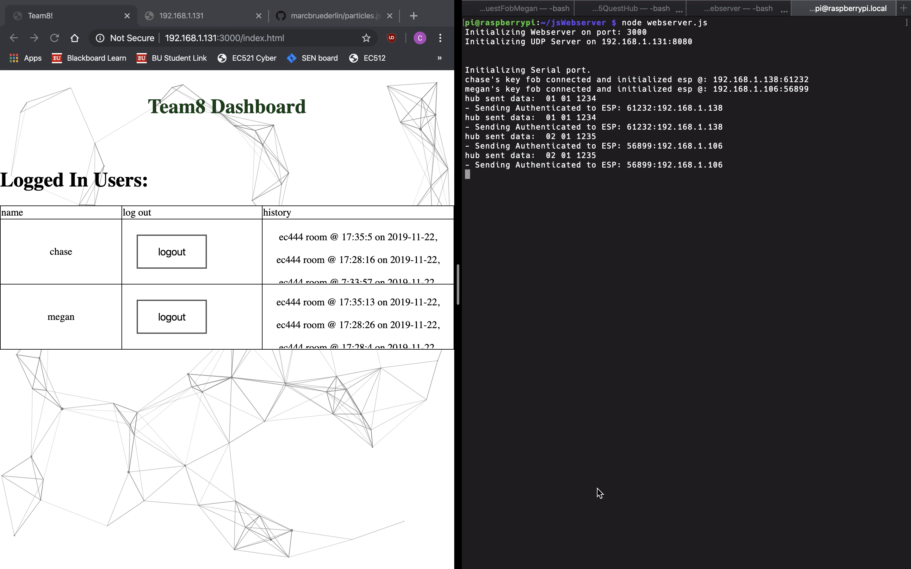

# IR Communication Key Fob
Authors: Chase Clarke, Megan Heydari, Leila Lee 

2019-11-21

## Summary
This lab prompted us to create a secure key, comprised of a computer, a hub, and multiple key fobs. The key fobs and hub communicate via IR signals: the fob emits IR signals using an IR LED that are received by the IR receiver on the hub. Information about the fob that wants access is passed through the hub to the computer, in our case a Raspberry Pi Zero. The computer queries a TindoDB database to confirm that the ID and passoword of the fob are verified users. If the fob credentials are recognized as correct, the fob will be granted access to the hub. In other words, the hub becomes "unlocked". During this process, our design uses two additional LEDs to provide feedback to the user regarding the validating (blue) and access granted (green) stages of the process. 

On the server side, the system logs all of the data related to every login. Namely: 
  - Fob ID 
  - Hub ID 
  - Name 
  - Time 
  - Location
  
The name and location data points are derivative of the Fob ID and Hub ID data points. The TingoDB database maps the ID numbers to names and locations to add meaning to them.

## Evaluation Criteria
Solution Requirements, pulled from [Whizzer](http://whizzer.bu.edu/quests/primary/secure-key)
- Database logs each key-open request including time stamp, fob_ID, hub_ID, and name of person with fob Queries to database will reveal

- Time series for (fob_ID)

- Presence (indicates if a device has ‘checked-in’) to a room

- Button press received at hub is passed to RPi where it is validated. RPi contacts the key fob by WiFi and then the key fob turns on a green LED to indicate that key granted access.

## Solution Design

### Overall System Design 
The secure key system is comprised of three hardware systems:
  1. The key fob
  2. The hub
  3. The computer (Raspberry Pi)
  
Additionally, the system takes advantage of two software systems: 
  1. A relational database (TingoDB)
  2. A web client (node.js)

The key fob provides inputs to the security hub by providing its ID and a password (determined by our team). For our model, every hub will have a unique password that the key must provide. The key fob accepts only one input, from the Raspberry Pi, which indicates if access has been granted.

The security hub accepts the ID and password input from the fob, as mentioned above, and relays this information along with its own hub ID to the Raspberry Pi. 

The Raspberry Pi takes the fob ID, hub ID, and password and references the database to see if this fob ID is recognized by this Hub and confirms that the given password is correct. If all of these connections are made, the Raspberry Pi sends an accesss granted signal to the key fob. The user will know this is the case, as the fob's LED will turn green. If the information that the fob sends does not agree with the system's database, the Raspberry Pi will send no signal at all and the user will know that access has been denied through the absence of the LED light. 

System Diagram:

  

 

      
### Transmitter 
The transmitter of in our system is comprised of an ESP32, 2 LEDs, an H-Bridge (acting as an AND gate), an IR LED, and various resistors. 

A visual of our transmitter can be seen here: 

  

 

A UART signal is generated by the ESP32 containing the data we wish to transmit. This signal is ANDed through the H-bridge with a carrier signal of 38 kHz. We generate this carrier signal by scraping some code from the RMT espressif code (as seen on Piazza). We choose this carrier frequency, specifically, for a practical reason; because this is the frequency with which the receiver operates. 

The modulated signal is then expressed through the IR LED which sends infrared pulses for the receiver to interpret. The transmitter transmits its ID and a password that the hub will recognize (if correct). The transmitter receives the access granted signal from the computer (raspberry pi) when its credentials have been validated. 

The transmitter is equipped with two additional LEDs. The blue LED indicates that the signal is being transmitted and processed by the system. The green LED indicates that the user is valid and the access has been granted to the fob. One will notice that as the LEDs change, the web client updates accordingly with log-in log-off information about the fob. 

### Receiver 
The receiver is comprised of an ESP32 and a receiver diode. The receiver diode interprets the infrared pulse emitted by the IR LED. Internally, the receiver diode filters out the 38 kHz carrier signal, leaving just the data for the receiver side ESP32 to use. The receiver relays the fob ID, password, and its own ID to the Raspberry Pi. From this point forward, the Raspberry Pi does the rest of the work.

### Raspberry Pi 

For this quest, we use a Raspberry Pi Zero in order to access our database and host our web server. The fob sends information regarding its ID and passcode to the hub. The hub relays this information, as well as its own ID to the Raspberry Pi, which then references the database and makes a logical decision based on our finite state machine as to whether the fob should be granted access or not. 

In order to access our TingoDB database and update values for our node.js file, the Pi must be equipped with the appropriate drivers and packages. Namely, node.js and npm. We confirmed what version of ARM the Pi uses (ARMv6) and installed the Node.JS Linux Binaries. After extracting and copying to the Pi's local directory, the Pi is configured with node.js and npm capabilities. For good measure, one should check the version of these before getting started: 

  

 

The logic behind this finite state machine is simple. If the system is locked, and the fob ID and password correspond to the hub ID (as located in the database), then the fob will receive an unlocked signal. This is the basis for "unlocking" in our system. 

The other possible scenarios can be found in our state table: 

  

 

### UDP Client 
The UDP server is set up by running a node.js file on the raspberry pi. The UDP client, located on the ESP32, is accessing the server.

### Web client 

  

 

### Database -- TingoDB
We use the TingoDB database in order to store fob IDs, hub IDs, passwords, names, hub locations, and times of login. The database is queried by the fobID in order to find the name associated with the ID to display on the web client. Once the correct user has been found, the information regarding the previous login times will also be displayed on the web client. The database keeps a running log of all the log ins (not log in attempts, only successful log ins).

### Investigative Question
Investigative question: comment on the security of your system. How would you best hack into this system if you were so inclined? How could you prevent this attack? Describe the steps.

None of the data we transmit is encrypted; therefore, anyone with the proper IR reading equiptment could listen in on our transmission of fob IDs, hub IDs, and passwords and then fabricate them to hack into the system. In order to avoid this, we could encrypt our signals before transmission in order to protect their contents. 

## Sketches and Photos

Finite State Machine State Table: 

  

 

Finite State Machine Diagram:

  

 

Node.js and Npm installs

  

 

Web Client: 

  

 

System Diagram:

  

 

## Supporting Artifacts
- [Link to repo](https://github.com/BU-EC444/Team8-Clarke-Heydari-Lee/tree/master/quest-5)

Video Demo:

## References
[IR Communication](http://whizzer.bu.edu/briefs/design-patterns/dp-irtxrx)

[IR Receiver Diode](https://www.sparkfun.com/products/10266)

[IR LED](https://www.sparkfun.com/products/9349)

[Espressif RMT documentation](https://docs.espressif.com/projects/esp-idf/en/latest/api-reference/peripherals/rmt.html#)

[Espressif RMT Github](https://github.com/espressif/esp-idf/tree/93a8603c5/examples/peripherals/rmt_nec_tx_rx_)

[Installing Node.js and Npm on Raspberry Pi](https://www.instructables.com/id/Install-Nodejs-and-Npm-on-Raspberry-Pi/)
-----

